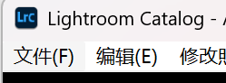
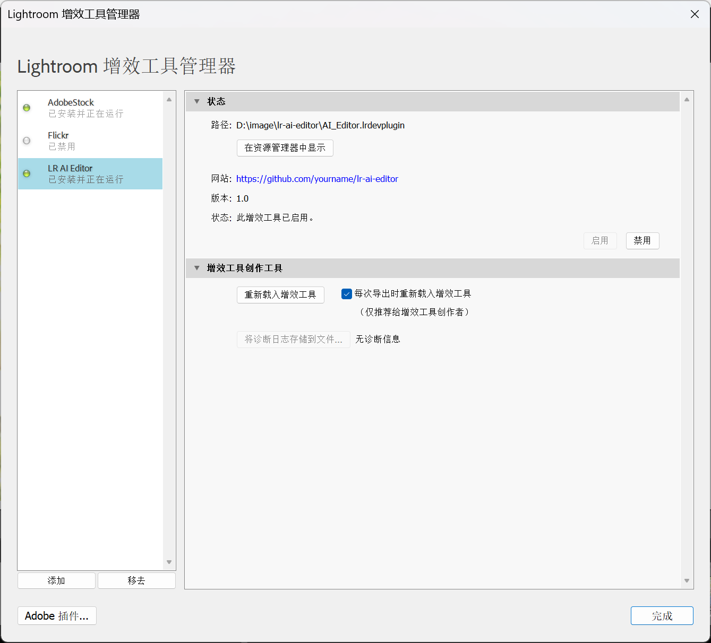

# LR AI Editor

Lightroom Classic AI修图助手

## 功能

- 选中照片后，AI分析并给出修图建议
- 可指定风格方向（如"电影感"、"高对比黑白"等）
- 可选择直接应用AI推荐的参数
- 支持完整的Lightroom Develop参数调整

## 架构

```
Lightroom (Lua插件)
    ↓ 导出小预览图 (384px)
    ↓ LrHttp.post 发送JSON请求
Python HTTP Service (worker_service.py)
    ↓ 直接调用 AI 模型 API
视觉模型 (GPT-4o / Claude / Mimo / Ollama)
    ↓ 返回JSON (建议 + 参数)
Lightroom
    ↓ 显示结果对话框
    ↓ 可选：应用参数到Develop滑块
```

## 安装

### 1. 安装Python依赖

```bash
cd worker
pip install -r requirements.txt
```

### 2. 配置模型

编辑 `worker/config.py`，设置模型和 API Key：

```python
# 使用 OpenAI
DEFAULT_MODEL = "openai/gpt-4o"
API_KEY = "your-openai-key"

# 使用 Anthropic
DEFAULT_MODEL = "anthropic/claude-3-5-sonnet-20241022"
API_KEY = "your-anthropic-key"

# 使用自定义 API
DEFAULT_MODEL = "xiaomi_mimo/mimo-v2.5"
API_KEY = "your-api-key"
API_BASE = "https://your-api-base/v1"
```

或通过环境变量配置：
```bash
set DEFAULT_MODEL=your-model
set API_KEY=your-key
set API_BASE=your-base-url  # 可选
```

### 3. 安装Lightroom插件

1. 打开 Lightroom Classic
2. 点击菜单 **文件 → 增效工具管理器**

   

3. 在增效工具管理器窗口中，点击左下角的 **添加** 按钮
4. 选择 `AI_Editor.lrdevplugin` 文件夹
5. 安装成功后，插件列表中会显示 "LR AI Editor"

   

**开发提示**：修改插件代码后，在增效工具管理器中点击 **重新载入增效工具** 即可生效，无需重启 Lightroom。

**注意**：确保 `python` 在系统 PATH 中可用（命令行运行 `python --version` 能正常显示版本）

## 使用

### 启动服务

使用前需要启动 HTTP 分析服务：

```bash
cd worker
python worker_service.py --port 5000
```

服务启动后会显示：
```
LR AI Editor 服务启动在 http://127.0.0.1:5000
API 端点:
  GET  /health  - 健康检查
  POST /analyze - 分析图片
```

### 在 Lightroom 中使用

1. 在 Lightroom 中选中一张照片（建议先切换到 Develop 模块）
2. 点击菜单 **文件 → 增效工具额外功能 → AI Analyze Photo**（与"增效工具管理器"在同一菜单下）

   

3. 在弹出的对话框中输入风格描述（可选），例如：
   - "自然干净的人像，肤色优先"
   - "电影感，偏暖色调"
   - "高对比黑白风格"
4. 点击确定，等待 AI 分析（约 5-30 秒）
5. 查看分析结果和建议参数
6. 勾选"应用这些参数到照片"，点击确定应用

## 配置项

### worker/config.py

通过环境变量配置：

| 变量 | 说明 | 默认值 |
|------|------|--------|
| `LITELLM_PROXY_API_KEY` | LiteLLM密钥 | `sk-lr-editor` |
| `LITELLM_PROXY_API_BASE` | LiteLLM地址 | `http://localhost:4000` |
| `DEFAULT_MODEL` | 默认模型 | `litellm_proxy/mimo` |
| `REQUEST_TIMEOUT_SECONDS` | 请求超时 | `60` |

### Editor.lua 内置配置

| 参数 | 说明 | 当前值 |
|------|------|--------|
| `SERVICE_URL` | HTTP服务地址 | `http://127.0.0.1:5000/analyze` |
| `PREVIEW_SIZE` | 预览图尺寸 | 384px |
| `REQUEST_TIMEOUT` | HTTP超时 | 60秒 |

## 支持的调整参数

### 基本调整
- Exposure (曝光)
- Contrast (对比度)
- Highlights (高光)
- Shadows (阴影)
- Whites (白色色阶)
- Blacks (黑色色阶)
- Texture (纹理)
- Clarity (清晰度)
- Dehaze (去朦胧)
- Vibrance (自然饱和度)
- Saturation (饱和度)
- Temperature (色温)
- Tint (色调)

### HSL调整
- Red / Orange / Yellow / Green / Aqua / Blue
- Hue (色相)、Saturation (饱和度)、Luminance (明亮度)

### 色调曲线
- ParametricShadows / Darks / Lights / Highlights

### 锐化与降噪
- Sharpness (锐化数量)
- SharpenRadius (锐化半径)
- SharpenDetail (锐化细节)
- SharpenEdgeMasking (锐化蒙版)
- LuminanceSmoothing (明亮度降噪)
- ColorNoiseReduction (颜色降噪)

### 效果
- PostCropVignette (裁剪后暗角)
- Grain (颗粒)

### 分离色调
- ShadowHue / ShadowSaturation
- HighlightHue / HighlightSaturation
- Balance (平衡)

### 镜头校正
- LensProfileEnable (镜头配置文件)
- AutoLateralCA (移除色差)
- LensManualDistortionAmount (手动畸变)
- LensVignetting (镜头暗角)

## 图片大小控制

- 预览图尺寸: 384px
- JPEG质量: 50%
- 不发送原图，严格控制体积

## 目录结构

```
lr-ai-editor/
├── AI_Editor.lrdevplugin/    # Lightroom插件
│   ├── Info.lua              # 插件信息
│   ├── Editor.lua            # 主逻辑
│   └── config.lua            # (已弃用)
├── worker/                   # Python Worker
│   ├── worker.py             # AI调用逻辑
│   ├── config.py             # Worker配置
│   └── requirements.txt      # Python依赖
├── litellm_config.yaml       # LiteLLM配置
└── README.md
```